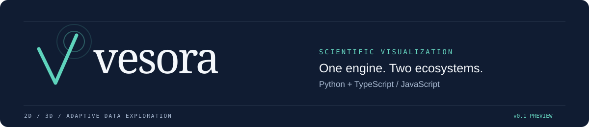
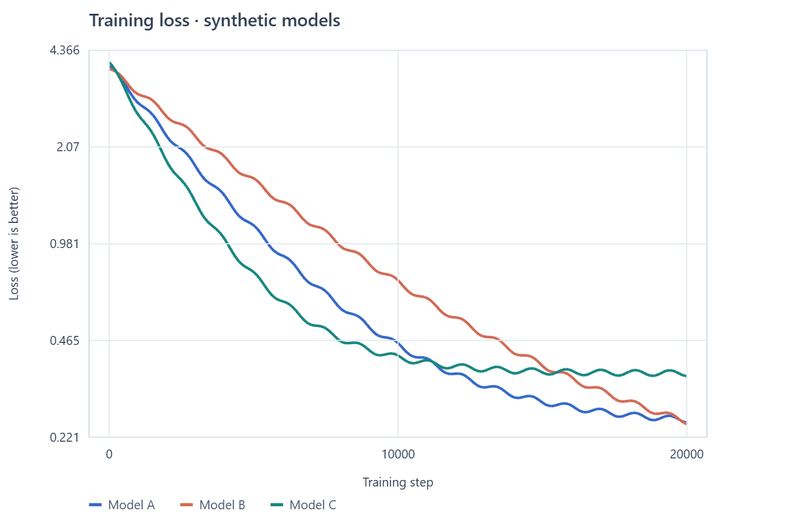
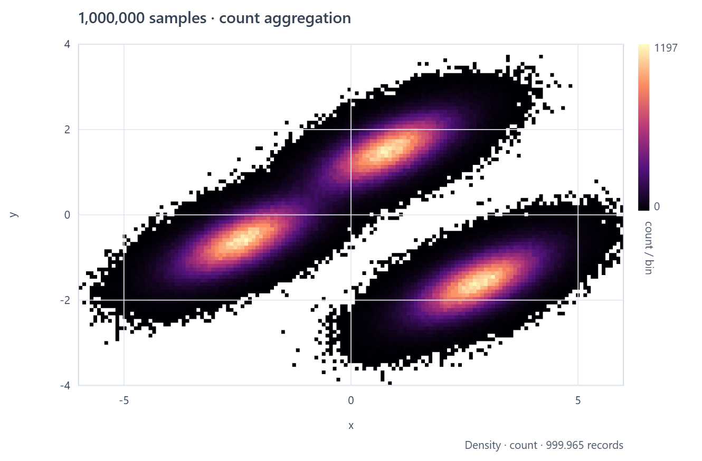
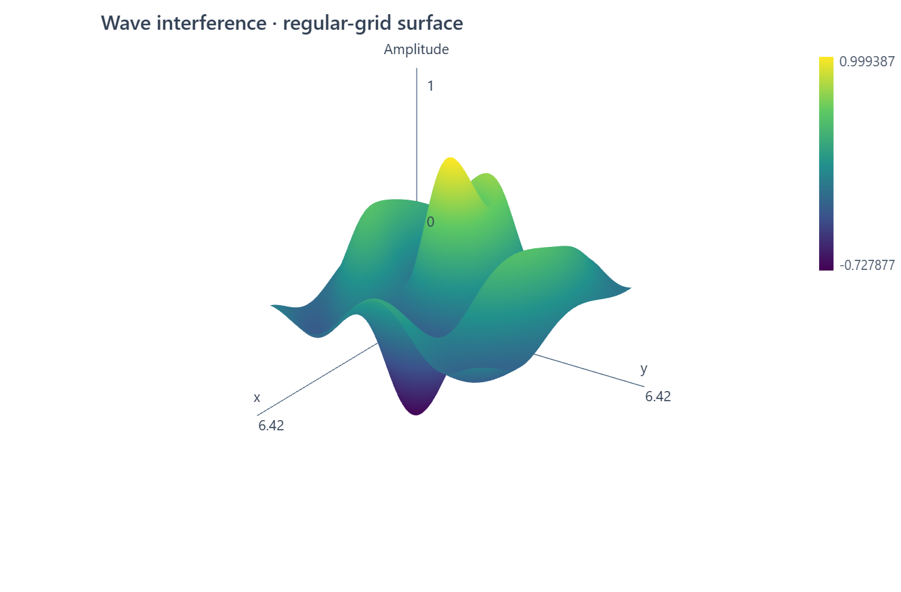
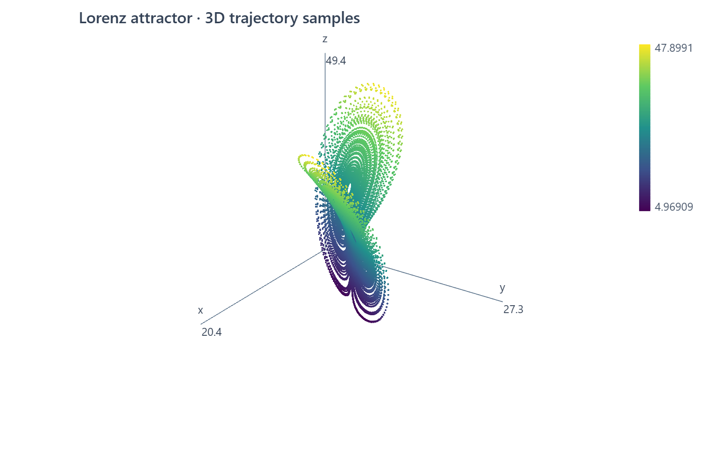

<p align="center">
  
</p>

<p align="center">
  <strong>Explore scientific data in Python and on the web with the same visualization engine.</strong><br>
  Interactive 2D plots · Mathematical surfaces · Adaptive data representations
</p>

<p align="center">
  <a href="#see-it-in-action">Gallery</a> ·
  <a href="#get-started">Quick start</a> ·
  <a href="#how-it-compares-with-matplotlib">Vesora &amp; Matplotlib</a> ·
  <a href="docs/api.md">API reference</a> ·
  <a href="https://github.com/U-C4N/Vesora/releases/tag/v0.2.0">Download v0.2.0</a>
</p>

> **Developer preview.** The API is evolving. WebGL2 is required; Python desktop windows use QtWebEngine. Install the prebuilt GitHub Release packages below. Vesora is not published to PyPI or the npm registry yet.

## See it in action

These are **real PNG exports from Vesora's shared engine**, generated through the Python API without NumPy. Click a figure to inspect it at full resolution.

| Compare learning curves | Explore dense measurements |
| :---: | :---: |
| [](docs/assets/training-loss.png) | [](docs/assets/density.png) |
| Multi-series lines, log scales and legends. **Synthetic models; not reported benchmark results.** | 1,000,000 generated samples, aggregated into screen-space bins. Color means **count per bin**. |
| **Inspect mathematical surfaces** | **Follow nonlinear dynamics** |
| [](docs/assets/surface.png) | [](docs/assets/lorenz.png) |
| A 140 × 140 regular grid, with color mapped to amplitude. | 19,000 numerical trajectory samples, with color mapped to z. |

The [interactive gallery](examples/web/) contains **16 experiments: 11 in 2D and 5 in 3D**. Explore line charts, synthetic AI comparisons, heatmaps, large-coordinate precision, density plots and chaotic systems. Pan, zoom, rotate, toggle series, change model parameters and export a PNG or an interactive HTML file. Every experiment includes Python and JavaScript code.

## New in v0.2: share interactive discoveries

Send a figure as **one self-contained HTML file**. The recipient can open it directly in a WebGL2-capable browser, without Python, a local server, or internet access. Save named viewpoints to guide the reader from an overview to a detail, then let them explore freely.

```python
import math
import vesora as vs

x = [i / 100 for i in range(1200)]
y = [math.sin(t) + 2 * math.exp(-((t - 5) / 0.06) ** 2) for t in x]
fig = vs.figure(title="A narrow peak in a signal")
fig.plot(x, y, label="Signal")
fig.bookmark("Overview")
fig.set_axes(xlim=(4.8, 5.2))
fig.bookmark("Narrow peak", note="Zoom in to inspect the short disturbance.")
fig.restore_bookmark("Overview")
fig.save_html("experiment.html")
```

No window needs to open to create the file. In JavaScript, use `toHTML(fig)` for a string or `downloadHTML(fig, "experiment.html")` for a browser download. The exported viewer includes bookmarks, reset, PNG download, and a per-layer inspector explaining the current representation.

Try the [downloadable discovery demo](https://github.com/U-C4N/Vesora/releases/download/v0.2.0/vesora-discovery-demo.html): one million synthetic measurements and three saved viewpoints. HTML contains the original exported data, not just the points currently drawn. Python callbacks, gallery parameter sliders, and live data connections are not included. See [the sharing API](docs/api.md#share-an-interactive-figure).

Run it locally from a checkout:

```bash
npm ci
npm run build
npm run demo
```

Open **[localhost:4173/examples/web/](http://127.0.0.1:4173/examples/web/)**. Node.js 22+ is needed for development. The images above are static previews; the local gallery is interactive. Regenerate the images with [`scripts/render_readme.py`](scripts/render_readme.py).

## Why Vesora exists

A scientific workflow can begin in a Python script, move into a notebook and end up in a browser application. Rebuilding the chart for each environment means repeating scale logic, interactions, selection behavior and export code. As data grows, plotting every sample can also obscure the structure you are trying to find.

Vesora brings those workflows onto **one TypeScript engine with two language APIs**. Python prepares data and sends a versioned scene plus binary buffers; JavaScript uses the engine directly. Rendering, scales, cameras, selection and representation planning live in the shared core.

| The problem | Vesora's approach |
| --- | --- |
| A Python chart and its web counterpart drift apart | Shared scene semantics and rendering, with Python/JS parity checks. |
| Dense point clouds hide useful structure | Automatic count aggregation for dense views; individual points when the view is sparse. |
| Reducing a long signal can erase a narrow peak | View-dependent line reduction retains local extrema, ordering and missing-data gaps. |
| Scientific values lose small differences at large offsets | Float64 source coordinates stay separate from normalized GPU coordinates. |
| Users cannot tell what a reduced view represents | `fig.inspect()` reports the representation, counts, method and exactness. |

Python functions run in Python, and JavaScript functions run in JavaScript. Supply their sampled arrays or grids to Vesora; the engine does not translate arbitrary functions between languages.

## Get started

Download the appropriate asset from the **[v0.2.0 release](https://github.com/U-C4N/Vesora/releases/tag/v0.2.0)**. `SHA256SUMS.txt` is included for verifying the packages.

### Python: a plot in a few lines

With Python 3.10+, install the downloaded wheel:

```bash
python -m pip install ./vesora-0.2.0-py3-none-any.whl
```

```python
import math
import vesora as vs

x = [i / 100 for i in range(1200)]
vs.plot(x, [math.sin(t) for t in x], label="sin(x)")
vs.show()
```

`show()` opens a desktop window and keeps a normal script running until it closes. The wheel includes the compiled engine: **no Node.js setup and no mandatory NumPy dependency**. The desktop installation includes `PySide6` and `aiohttp`.

Use a figure explicitly for multiple layers, updates or export:

```python
fig = vs.figure(title="Two views of a signal")
fig.plot(x, [math.sin(t) for t in x], label="sin(x)", color="#3569c8")
fig.plot(x, [math.cos(t) for t in x], label="cos(x)", color="#d36a55")
fig.set_axes(xlabel="Time (s)", ylabel="Amplitude")
fig.savefig("signal.png")
fig.show()
```

Lists, tuples, `array.array` and supported numeric buffers work out of the box. Existing NumPy arrays also work when NumPy is installed. For notebook support, install the same wheel with the optional extra:

```bash
python -m pip install "./vesora-0.2.0-py3-none-any.whl[notebook]"
```

### JavaScript / TypeScript: the same engine in your app

Place the downloaded tarball in your frontend project and install it:

```bash
npm install ./vesora-core-0.2.0.tgz
```

Add a mount element to your HTML:

```html
<div id="chart"></div>
```

Then use the package from a browser frontend entry point with an ESM-capable bundler:

```typescript
import { figure } from "@vesora/core";

const chart = document.getElementById("chart");
if (!chart) throw new Error("Missing #chart element");

const x = Float64Array.from({ length: 1200 }, (_, i) => i / 100);
const fig = figure({ title: "Two views of a signal" });
fig.plot(x, x.map(Math.sin), { label: "sin(x)", color: "#3569c8" });
fig.plot(x, x.map(Math.cos), { label: "cos(x)", color: "#d36a55" });
fig.setView({ xLabel: "Time (s)", yLabel: "Amplitude" });
fig.mount(chart);
```

The core package includes TypeScript declarations and has **no runtime npm dependencies**. It needs browser APIs and WebGL2 to render. The package's `dist/index.js` can also be imported directly from an HTTP-served page; keep `dist/worker.js` alongside it. See the [API reference](docs/api.md) for updates, events, PNG downloads and cleanup.

## How it compares with Matplotlib

**The key difference is the shared Python/browser architecture.** Vesora is a young engine for interactive scientific exploration across both ecosystems. Matplotlib provides a much broader plotting system and export ecosystem today.

| Dimension | Vesora today | Matplotlib today |
| --- | --- | --- |
| Programming model | Python and JS/TS APIs feed the same TypeScript engine. | Python plotting APIs with pluggable output backends. |
| Rendering | WebGL2 data drawing; Canvas2D text and annotations. | Multiple raster, vector and interactive backends. |
| Interaction | Pan/zoom, 2D hover and region selection, 3D orbit in the shared viewer. | Interactive figures, navigation tools and an event system. |
| Dense data | Automatic scatter count aggregation, extrema-preserving line reduction and representation inspection. | Line simplification, marker subsampling and Agg path chunking are available. |
| 3D | Regular-grid surfaces and 3D scatter with depth testing. | `mplot3d` supports a wider range of 3D plot types. |
| Export | PNG, including axes and labels; self-contained interactive HTML with bookmarks. | PNG, SVG, PDF and other formats, depending on backend. |
| Maturity | v0.2 preview; five plot types; API still evolving. | An established plotting library with extensive configuration and documentation. |

Choose Vesora when sharing one engine between Python and a browser application is central to your workflow. Prefer Matplotlib today when you need its broader plotting catalog, publication layout controls or vector export. Vesora does not implement the Matplotlib API, and this project makes **no unmeasured speedup claim** against it.

Comparison references: Matplotlib's official [backend documentation](https://matplotlib.org/stable/users/explain/figure/backends.html), [interactive figures](https://matplotlib.org/stable/users/explain/figure/interactive.html), [performance options](https://matplotlib.org/stable/users/explain/artists/performance.html) and [`mplot3d` reference](https://matplotlib.org/stable/api/toolkits/mplot3d.html).

## Inside the engine

```text
Python API                            JavaScript / TypeScript API
    │                                             │
    └── desktop / notebook host + binary bridge ───┤
                                                  ▼
                                    Shared TypeScript engine
                                scene · scales · camera · selection
                                                  │
                                  Viewport / representation planner
                                    worker queries · bounded cache
                                                  │
                                   WebGL2 data + Canvas2D labels
                                                  │
                                     Interactive view / PNG export
```

The Python adapter manages the local viewer connection. Numeric buffers retain their dtype, shape and version. Query cancellation prevents late results from an older view replacing a newer one. Layer updates reuse the figure; `close()` releases its viewer resources. Read the [architecture guide](docs/architecture.md) for the contracts and limits.

## What works, and what comes next

| Available in the preview | Planned extensions |
| --- | --- |
| `plot`, `scatter`, `heatmap`, `surface`, `scatter3d` | Vector fields and adaptive function sampling |
| Linear/log scales, legends and colorbars | More layout and scientific annotation tools |
| Desktop Python, notebook adapter and browser JS/TS | Additional data providers and host integrations |
| In-memory adaptive representations and cancellable queries | Indexed disk data, tiles, chunks and streaming |
| PNG and self-contained HTML export, named view bookmarks | SVG/PDF export and additional render backends |

Data scans are currently **O(n)** and workers may copy source buffers. The million-sample example demonstrates aggregation; it is not a universal frame-rate guarantee. Indexed out-of-core data, general mesh/volume rendering and a 100-million-record performance guarantee are outside this release. WebGPU is a future option to evaluate against measured bottlenecks.

## Develop and validate

From a checkout, using Node.js 22+ and Python 3.10+:

```bash
npm ci
npm run build
python -m pip install -e ".[test,notebook]"
npm run check
npm run test:parity
npm run test:examples
npx playwright install chromium
npm run test:browser
python -m pytest tests/python
```

The checks cover scene equivalence, real rendered pixels, invalid values and gaps, stale queries, layer updates, exports and resource cleanup. The gallery's **16 Python snippets run with NumPy blocked**, alongside their 16 JavaScript equivalents. Real Qt desktop tests are opt-in; the browser tests use software WebGL and are not hardware benchmarks.

| Read next | What you will find |
| --- | --- |
| [API and examples](docs/api.md) | Plot types, data updates, selection, notebook use and export |
| [Architecture](docs/architecture.md) | Shared scene model, binary protocol and representation rules |
| [Development and benchmarks](docs/development.md) | Packaging, validation, measured performance and support limits |
| [Interactive examples](examples/web/) | Sixteen experiments with Python and JS source |
| [Release notes](docs/releases/v0.2.0.md) | Downloadable packages and the scope of the first preview |

Have a reproducible rendering issue or a scientific workflow Vesora should support? [Open an issue](https://github.com/U-C4N/Vesora/issues) with a small dataset, the expected result and your environment.
