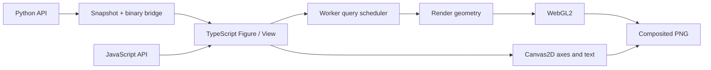

# Ortak çekirdek ve veri modeli

Python paketi bir sahne ve binary veri üretir. Çizim, ölçekler, yerleşim, kamera ve temsil planlaması aynı TypeScript motorunda çalışır. JS API bu motoru doğrudan çağırır; Python için ikinci bir renderer yoktur.

## Sahne ve kaynaklar

`FigureSpec`, view ve layer tanımlarını içerir. `ViewSpec` lineer/log ölçekleri, domain'leri, eksen adlarını ve kamerayı taşır. `LayerSpec` kaynak dizilerine kimlikle referans verir; veri dizileri JSON'a yazılmaz.

Her `DataDescriptor` için `id`, `dtype`, `shape`, artan `version`, `byteLength` alanları bulunur. Binary veri little-endian'dır. Protokol sürümü `1`; uyumsuz sürüm reddedilir. Buffer uzunluğu dtype × shape ile doğrulanır. Aynı kaynak kimliği güncellendiğinde version artar; kaldırılan kaynak worker ve sonuç cache'inden de çıkarılır.

Desteklenen kaynak türleri Float32/Float64 ile 8/16/32 bit işaretli/işaretsiz integer'lardır. JS normal number dizileri Float64 olur. Python 64 bit integer'ları yalnızca Float64'te kesin temsil edilebilen aralıkta dönüştürür; dışındaki değerleri reddeder. Kaynak Float64 verisi GPU'ya doğrudan Float32 olarak gönderilmez: görünüm dönüşümü kaynak hassasiyetinde yapılır, göreli koordinatlar Float32 geometriye çevrilir.

Python veri adaptörü standart kütüphaneyle çalışır; listeleri ve sayısal buffer protocol girişlerini ortak binary veri tanımına çevirir. NumPy zorunlu bağımlılık değildir. Kurulu olduğunda NumPy dizileri aynı buffer yolu üzerinden alınır; çizim çekirdeği değişmez.

Matematiksel Python fonksiyonları JS'ye çevrilmez. Kullanıcının `math` tabanlı hesaplama kodu veya isteğe bağlı NumPy işlemleri modeli örnekler, sonuç dizilerini ortak motora verir. Temel pakette `aiohttp` yerel bağlantıyı, `PySide6` masaüstü host'u sağlar; `notebook` extra'sı anywidget, `numpy` extra'sı NumPy kurulumu içindir.

## Temsil planlama

Scatter planlayıcısı görünür veriyi ekran uzayında hücrelere sayar. `auto` yoğun görünümde count aggregation, seyrek görünümde orijinal noktalar seçer. Density'den noktalara dönüş için daha düşük eşik kullanılması küçük zoom hareketlerinde temsillerin sürekli değişmesini engeller. `points` zorlandığında bütçe aşılırsa hata oluşur; örnekler sessizce atılmaz.

Çizgi planlayıcısı ardışık ekran sütunu gruplarında ilk/son ve minimum/maksimum değerleri kaynak sırasıyla korur. NaN, sonsuz ve log ölçeğinde geçersiz değerler segmenti sonlandırır. Görünümden geçen, iki ucu dışarıdaki çizgi parçaları korunur. Çok karmaşık topoloji bütçeyi aşarsa hata raporlanır.

Hesaplama 65.536 kayıtlık parçalarda ilerler ve iptali denetler. Worker kullanılamadığında işbirlikçi ana thread yolu vardır. Kaynak dizileri worker'a her görünüm değişiminde tekrar gönderilmez; yalnızca yeni veri sürümünde aktarılır. Sorgu sonuç cache'i varsayılan olarak 32 MiB ve 100 kayıtla sınırlıdır. Yeni sorgu aynı layer'ın eski sorgusunu iptal eder; eski sonuç yeni görünümü değiştiremez.

Bu sınırlar bütün süreç belleğini sınırlamaz: kaynak veriler, worker kopyaları, geometri ve GPU buffer'ları ek bellek kullanır. Bu sürüm indeks kurmaz; görünüm sorguları bellek içi veri üzerinden O(n) tarama yapar. Çok büyük veriler için indeksli/uzak veri sağlayıcıları sonraki mimari genişlemedir.

Figure görünümü 250.000 noktalık sorgu bütçesi kullanır; yoğun scatter otomatik olarak count temsiline geçer. Heatmap/surface ve 3D scatter için bir milyon kaynak değer kontrolü, layer geometrisi için iki milyon vertex sınırı vardır. Grid üçgenlemesi bu sınırı kaynak değer sayısından önce doldurabilir; bütçe aşımı hata üretir. `inspect().rendered`, scatter için çizilen noktaları, çizgi için korunan kaynak indekslerini, density için dolu hücreleri, heatmap için çizilen hücreleri ve surface için üçgenleri sayar. `method` alanı kullanılan temsili açıklar.

## Render ve export

WebGL2 geometriyi çizer. Her layer için GPU buffer nesneleri tekrar kullanılır; stil/veri değişimlerinde içerik güncellenir. Canvas2D yalnızca eksen, metin, legend, colorbar ve etkileşim açıklamaları içindir. Bağımsız Canvas2D çizim backend'i bulunmaz.

Renderer yetenekleri `name`, `supports3d`, `rasterExport`, `vectorExport` alanlarıyla ifade edilir. PNG export iki canvas'ı birleştirir. WebGPU, SVG ve PDF bu sürümde uygulanmamıştır. GPU context kaybı hata olarak bildirilir; görünümü tekrar mount etmek kaynakları yeniden kurar.

Python host snapshot'ları artan bir revision taşır. Görüntüleyici bütün binary kaynakları ve çizimi tamamladıktan sonra aynı revision için hazır olduğunu bildirir. Yeni veri güncellemesi sırasında eski hazır/hata mesajları yok sayılır; export en son snapshot'ın tamamlanmasını bekler ve geçerli render hatasını eski görüntüye dönüştürmez.

Bilimsel görseller için boyut/eksen anlamı kaynak veriye aittir. Otomatik unit dönüşümü, projeksiyon sistemi ve sembolik matematik motoru yoktur.
