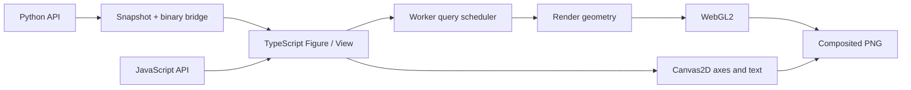

# Shared core and data model

The Python package produces a scene and binary data. Rendering, scales, layout, camera behavior, and representation planning run in one TypeScript engine. The JavaScript API calls this engine directly; the Python adapter uses the same renderer.

## Scenes and data sources

`FigureSpec` contains the view and layer definitions. `ViewSpec` carries linear/log scales, domains, axis labels, and camera settings. `LayerSpec` references source arrays by ID; the numeric arrays are transferred separately from JSON.

Each `DataDescriptor` includes `id`, `dtype`, `shape`, an increasing `version`, and `byteLength`. Binary data is little-endian. The protocol version is `1`; incompatible versions are rejected. Buffer length is validated against dtype and shape. Updating an existing source ID increases its version. Removing a source also removes it from the worker and result cache.

Supported source types are Float32/Float64 and signed/unsigned 8-, 16-, and 32-bit integers. Ordinary JavaScript number arrays become Float64. Python converts 64-bit integers only within the exact Float64 integer range and rejects values outside it. View transformations use source precision before converting relative coordinates to Float32 GPU geometry.

The Python data adapter uses the standard library to convert lists and numeric buffer protocol inputs into the shared binary representation. NumPy is optional. When installed, its arrays enter through the same buffer path and use the same rendering core.

Mathematical Python functions execute in Python. User calculations based on `math` or optional NumPy operations sample the model and send result arrays to the engine. The base package uses `aiohttp` for the local connection and `PySide6` for the desktop host. The `notebook` extra installs anywidget; the `numpy` extra installs NumPy.

## Plan the visual representation

The scatter planner counts visible samples into screen-space cells. In `auto` mode, it chooses count aggregation for dense views and original points for sparse views. A lower threshold for switching back from density to points prevents repeated changes around the transition during small zoom movements. Forcing `points` raises an error when the budget is exceeded; samples are not silently discarded.

The line planner preserves the first, last, minimum, and maximum samples in each consecutive group of screen columns, in source order. NaN, infinity, and values invalid on a log axis end a segment. Segments crossing the viewport are preserved even when both endpoints are outside it. If complex topology exceeds the budget, the planner reports an error.

Computation advances in chunks of 65,536 records and checks for cancellation. A cooperative main-thread path is available when workers cannot be used. Source arrays are sent to the worker only for a new data version; viewport changes send query parameters. The result cache defaults to a maximum of 32 MiB and 100 entries. A new query cancels the previous query for the same layer, and stale results cannot replace the current view.

These limits do not cap total process memory: source data, worker copies, geometry, and GPU buffers use additional memory. This version does not build a spatial index. Viewport queries perform O(n) scans over in-memory data. Indexed and remote data providers are future extensions.

The figure view uses a query budget of 250,000 points; dense scatter switches automatically to count aggregation. Heatmaps, surfaces, and 3D scatter have a one-million-source-value limit, and layer geometry has a two-million-vertex limit. Grid triangulation can reach the geometry limit before the source-value limit; exceeding either produces an error. `inspect().rendered` counts drawn points for scatter, retained source indices for lines, occupied cells for density, drawn cells for heatmaps, and triangles for surfaces. The `method` field explains the representation.

## Render and export

WebGL2 draws the geometry. GPU buffer objects are reused for each layer, with their contents updated as styles or data change. Canvas2D draws axes, text, legends, colorbars, and interaction annotations. It is not a standalone data-rendering backend.

Renderer capabilities are described by `name`, `supports3d`, `rasterExport`, and `vectorExport`. PNG export composites the two canvases. WebGPU, SVG, and PDF are not implemented in this version. A lost GPU context is reported as an error; remounting the view recreates its resources.

Python host snapshots carry an increasing revision. After loading every binary source and completing the render, the viewer acknowledges that revision. During a data update, stale ready/error messages are ignored. Export waits for the latest snapshot and reports a current rendering error rather than returning an older image.

Units and axis meaning come from the source data. Automatic unit conversion, geographic projection systems, and symbolic mathematics are outside the current engine.
