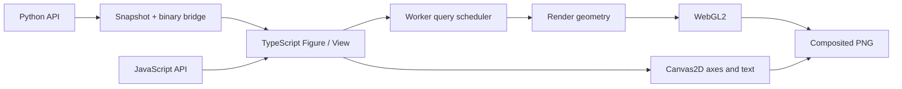

# Shared core and data model

The Python package produces a scene and binary data. Rendering, scales, layout, camera behavior, and representation planning run in one TypeScript engine. The JavaScript API calls this engine directly; the Python adapter uses the same renderer.

## Scenes and data sources

`FigureSpec` contains the view and layer definitions. `ViewSpec` carries linear/log scales, domains, axis labels, and camera settings. `LayerSpec` references source arrays by ID; the numeric arrays are transferred separately from JSON. A figure owns one data registry, one query scheduler, one WebGL context, and one Canvas2D overlay, including when it contains multiple panels.

Each `DataDescriptor` includes `id`, `dtype`, `shape`, an increasing `version`, and `byteLength`. Binary data is little-endian. Buffer length is validated against dtype and shape. Updating an existing source ID increases its version. Removing a source also removes it from the worker and result cache. The v0.4 reader accepts scene protocol versions `1`, `2` and `3`; unknown versions are rejected.

Supported source types are Float32/Float64 and signed/unsigned 8-, 16-, and 32-bit integers. Ordinary JavaScript number arrays become Float64. Python converts 64-bit integers only within the exact Float64 integer range and rejects values outside it. View transformations use source precision before converting relative coordinates to Float32 GPU geometry.

The Python data adapter uses the standard library to convert lists and numeric buffer protocol inputs into the shared binary representation. NumPy is optional. When installed, its arrays enter through the same buffer path and use the same rendering core.

Mathematical Python functions execute in Python. User calculations based on `math` or optional NumPy operations sample the model and send result arrays to the engine. The base package uses `aiohttp` for the local connection and `PySide6` for the desktop host. The `notebook` extra installs anywidget; the `numpy` extra installs NumPy.

## Compose a figure from panels

The legacy `FigureSpec.view` remains the canonical view for the main panel, and `FigureSpec.layers` remains a flat list of all layers. Existing single-panel scenes keep protocol `1` and their previous shape. Creating a grid or adding an annotation promotes the scene to protocol `2`. Removing the last annotation does not downgrade the scene. v1 scenes carrying these extensions are rejected instead of silently dropping content or drawing unrelated panels on the same axes.

| Scene field | Contract |
| --- | --- |
| `layout` | Optional fixed `{rows, cols, shareX, shareY}` grid; sharing flags are booleans. |
| `panels` | One entry per cell, with `id`, `row`, `col`, and `title`. `main` occupies `(0,0)` and omits `view`; secondary panels contain their complete view. |
| `LayerSpec.panelId` | Omitted for `main`; otherwise references a known panel. Layer IDs remain unique across the figure. |
| `annotations` | Optional text, horizontal-line, and vertical-line specs with a target panel, data coordinates, and style. They do not own numeric source buffers. |
| `ViewBookmark.panelViews` | Full views keyed by secondary panel ID; the existing `view` field stores the main panel. |

Grid panels are 2D. Single-panel 3D scenes retain the original path. `Panel` is a lightweight handle; it does not own a host, worker, canvas, or separate lifecycle. Layers still reference the figure's registry. Panel references, duplicate cells, dimensionality, annotations, shared limits, and complete bookmark maps are validated before a snapshot replaces the current scene.

Shared x/y axes propagate scale and domain changes through one atomic view update; labels remain independent. Automatic domains combine valid extents from visible layers in all linked panels, with padding applied once to the union. Heatmaps retain their cell-edge extent convention. Annotations are excluded from extent calculation. Invalid-log annotation positions are omitted, and all annotation drawing is clipped to its panel.

Layout computes equal grid cells and panel-local plot rectangles, legends, and colorbars. Minimum cell size is 360 × 260 CSS pixels; smaller host areas scroll over the full drawing area. A frame clears the canvas once, draws each panel with its own viewport and scissor, then releases unused layer buffers once. Query cancellation still uses globally unique layer IDs. A figure becomes ready only after every panel has rendered for the current generation.

## Plan the visual representation

The scatter planner counts visible samples into screen-space cells. In `auto` mode, it chooses count aggregation for dense views and original points for sparse views. A lower threshold for switching back from density to points prevents repeated changes around the transition during small zoom movements. Forcing `points` raises an error when the budget is exceeded; samples are not silently discarded.

The line planner preserves the first, last, minimum, and maximum samples in each consecutive group of screen columns, in source order. NaN, infinity, and values invalid on a log axis end a segment. Segments crossing the viewport are preserved even when both endpoints are outside it. If complex topology exceeds the budget, the planner reports an error.

Computation advances in chunks of 65,536 records and checks for cancellation. A cooperative main-thread path is available when workers cannot be used. Source arrays are sent to the worker only for a new data version; viewport changes send query parameters. The result cache defaults to a maximum of 32 MiB and 100 entries. A new query cancels the previous query for the same layer, and stale results cannot replace the current view.

These limits do not cap total process memory: source data, worker copies, geometry, and GPU buffers use additional memory. This version does not build a spatial index. Viewport queries perform O(n) scans over in-memory data. Indexed and remote data providers are future extensions.

The figure view uses a query budget of 250,000 points; dense scatter switches automatically to count aggregation. Heatmaps, surfaces, and 3D scatter have a one-million-source-value limit, and layer geometry has a two-million-vertex limit. Grid triangulation can reach the geometry limit before the source-value limit; exceeding either produces an error. `inspect().rendered` counts drawn points for scatter, retained source indices for lines, occupied cells for density, drawn cells for heatmaps, and triangles for surfaces. The `method` field explains the representation.

## Render and export

Standalone HTML packages a versioned envelope (`formatVersion: 1`) containing the scene snapshot and base64-encoded little-endian source buffers. One generated HTML template is shared by the Python and JavaScript exporters. It embeds the renderer, worker, CSS, and viewer controls; it makes no external asset requests. The build bundles the worker first, the standalone viewer second, and the public HTML exporter last to avoid recursively including the exporter in its own runtime.

The HTML envelope remains `formatVersion: 1` and can carry any supported scene protocol. Files embed a matching runtime; older engines reject unsupported protocol versions rather than dropping their features. Existing v0.2 self-contained files carry their original runtime and remain independent of an installed package update. Optional legacy `bookmarks` and `pan3d` remain supported; absent 3D pan means `[0, 0]`.

Each bookmark contains a name, optional plain-text note, the primary view, and all secondary views for a grid. It contains no data copies or historical annotation state. Restoring a bookmark validates and replaces the complete view collection atomically. The exported viewer's reset restores the full export-time collection.

Interaction events represent cleared domains explicitly as `null` so the Python adapter removes old limits even after JSON transport. Grid `viewchange` events retain the main view at the top level and add secondary `panelViews` plus the origin `panelId`. The Python adapter accepts that state without echoing a publication back to the browser. Python export captures the scene and source bytes under the same figure lock before serialization. Export retains source precision and missing-value bytes rather than saving reduced drawing geometry.

WebGL2 draws the geometry. GPU buffer objects are reused for each layer, with their contents updated as styles or data change. Canvas2D draws axes, text, legends, colorbars, and interaction annotations. It is not a standalone data-rendering backend.

Renderer capabilities are described by `name`, `supports3d`, `rasterExport`, and `vectorExport`. PNG export composites the two canvases for the complete layout, including annotations and panels outside the host's scroll viewport. WebGPU, SVG, and PDF are not implemented in this version. A lost GPU context is reported as an error; remounting the view recreates its resources.

Python host snapshots carry an increasing revision. After loading every binary source and completing the render, the viewer acknowledges that revision. During a data update, stale ready/error messages are ignored. Export waits for the latest snapshot and reports a current rendering error rather than returning an older image.

Units and axis meaning come from the source data. Automatic unit conversion, geographic projection systems, and symbolic mathematics are outside the current engine.

## Statistical preparation and categorical identity (v0.4)

Scene protocol 3 adds `hist`, `bar` and `boxplot` layers with type-specific `options`, `categorical` coordinate metadata, figure-level `categories` and panel-level `barModes`. Protocol promotion uses `max(current, required)`; adding an annotation to a statistics figure cannot demote it to v2. Readers still accept v1/v2 and validate a complete incoming scene before replacing live state.

Category maps are data/axis semantics, not `ViewSpec` or bookmark state. Keys are `x:main`, `y:panel-0-1`, etc.; a shared axis uses `x:shared` or `y:shared`. Maps append labels in first-occurrence order; numeric buffers carry ordinal codes. Encoding and data validation happen in a draft, so failed updates cannot leak category labels or partially increase source versions. Existing numeric planners receive linear ordinal geometry; axis ticks and hover decode labels separately.

Histogram layers retain a `samples` source. Bar layers retain x/y coordinates and an expanded `base` array. Boxplots retain an ordinal position source (x or y) and separate `g0`, `g1`, ... raw group sources, preserving each group's dtype. Python validates/serializes these sources but does not calculate statistics.

Render preparation now runs in this order:

1. Prepare exact histogram/boxplot summaries from versioned sources in a worker, with cooperative main-thread fallback.
2. Prepare panel-local grouped/stacked bar placement.
3. Derive extents from bins, rectangle widths/baselines, whiskers and visible outliers; union shared numeric axes before padding.
4. Build clipped triangle geometry with the existing renderer and commit all panels atomically.

Summary cache keys include every source dependency/version and statistical options, not viewport or style. Scheduler dependencies support multiple sources; release, invalidation, cancellation and byte limits apply to both line/scatter plans and statistical summaries. Boxplot sorting uses bounded chunks and cooperative merging rather than blocking on one unbounded sort. Cached summaries remain immutable when viewport-specific inspector counts are computed.

Category auto-domains cover their stable ordinal slots and expand for visible bar/box widths, including geometry in linked panels. Bar placement is cached separately by panel mode, order, source versions, visibility and options; shared axes do not merge stacking across panels. Box components retain one logical layer/legend/selection identity. Histogram and boxplot selection identifies bins/groups explicitly, rather than pretending their geometry is a list of raw samples.

The standalone `formatVersion: 1` envelope remains unchanged. Export includes raw sources and matching runtime; statistics are recomputed from the same data in the offline viewer. No new runtime npm or mandatory Python numeric dependency is introduced.
